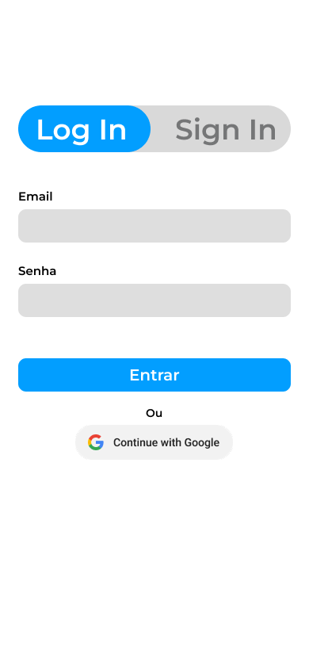
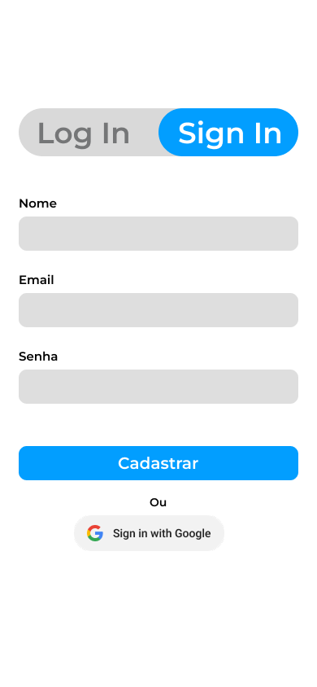
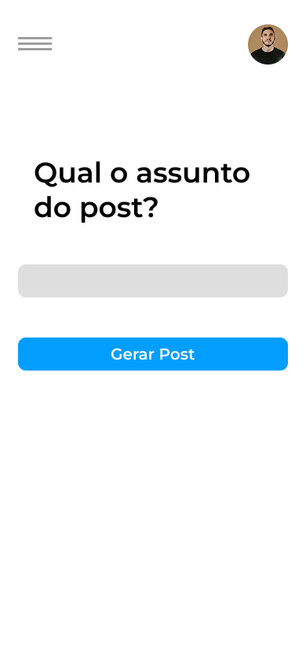
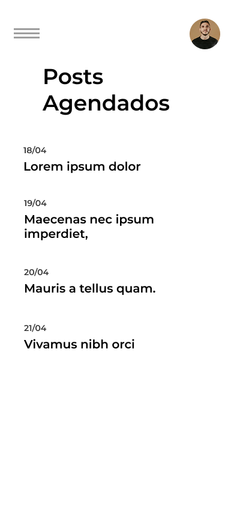
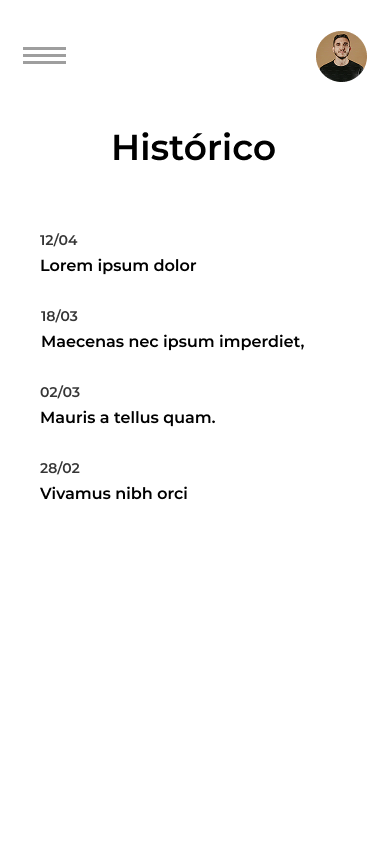
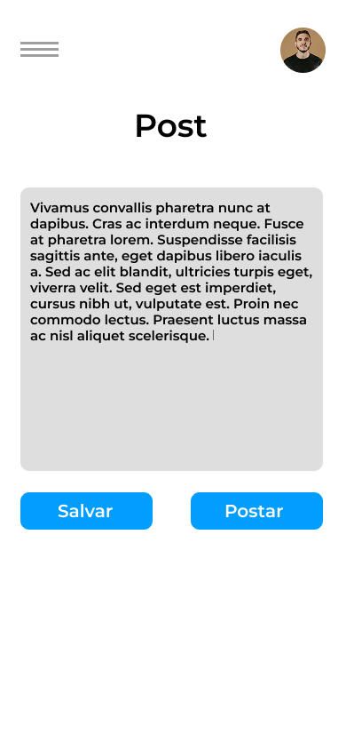
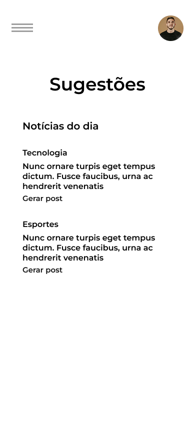

# 🤖 PostAi

### 📚 Disciplina: Desenvolvimento para Dispositivos Móveis  
### 🧑‍💻 Desenvolvedores:
- José Mário da Silva Santos
- RA: 2523825

- Luiz Felipe Freire Miguel
- RA: 2523884

- Aurélio Antônio B. de Miranda
- RA: 2523728

O **PostAi** é um aplicativo mobile que utiliza Inteligência Artificial para ajudar na criação de postagens personalizadas para redes sociais como LinkedIn, Instagram e Facebook. Com ele, o usuário pode gerar textos com base em temas, agendar publicações, salvar ideias e se conectar com suas redes sociais para publicar diretamente pelo app.

## 🚀 Funcionalidades

- ✍️ Geração automática de posts com IA
- 📰 Sugestões baseadas em temas ou notícias recentes
- 📅 Agendamento de postagens
- 📂 Histórico de postagens
- 💾 Salvar posts favoritos
- 🔗 Conexão com redes sociais para publicação direta

## 🛠️ Tecnologias Utilizadas

- **React Native** (Desenvolvimento mobile)
- **Figma** (Design das telas)
- **OpenAI API / GPT** (Geração de texto)
- **APIs de redes sociais** (Integração com Facebook, LinkedIn, Instagram)

## 🎨 Protótipo no Figma

Você pode visualizar o protótipo interativo aqui:  
[🔗 Ver no Figma](https://www.figma.com/proto/N5sXmlwMgALEnlN7SQwg6g/App?node-id=0-1&t=id7DMqX2kpfFMyN7-1)

---

## 🖼️ Galeria de Telas

### 🔐 Tela de Login  

### 🧾 Tela de Cadastro  

### 🏠 Tela Inicial (Geração de Post com IA)  

### 📆 Tela de Agendamentos  

### 🕓 Tela de Histórico  

### 💾 Tela de Posts Salvos  

### 💾 Tela de Edição dos Posts  

### 💾 Tela de Sugestões
